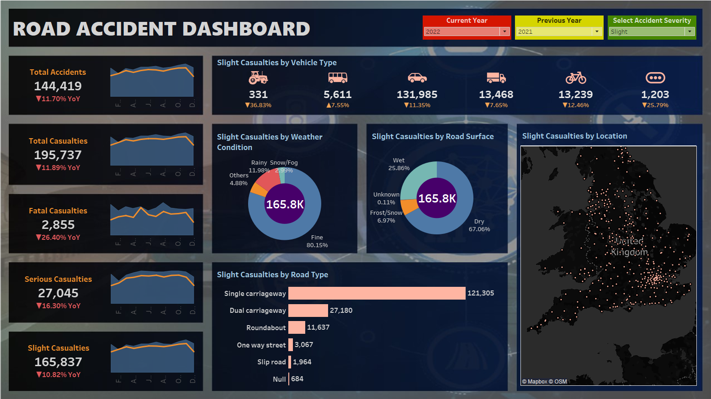

# Road Accident Dashboard Analytics: Enhancing Road Safety Through Data Visualization

## Introduction
In an era where data shapes the backbone of decision-making, understanding road safety trends is vital for creating safer environments. Our **"Road Accident Dashboard Analytics"** project delves into UK road accident data from 2019 to 2022, transforming complex data into insights that can guide transportation authorities, urban planners, and policymakers. This project uses Tableau to present accident data trends, hotspots, and contributing factors, helping to facilitate data-driven safety interventions.

## Project Objectives
The primary goals of the Road Accident Dashboard project are:
- **Trend Analysis**: Track annual changes in accident rates, spotting trends in increases or decreases.
- **Location Insights**: Identify regions with high accident frequencies to understand contributing factors.
- **Severity Assessment**: Evaluate the severity levels of accidents over time, including minor, major, and fatal incidents.
- **Demographic & Temporal Analysis**: Examine accidents based on age, gender, time of occurrence, and seasonal variations.
- **Root Cause Analysis**: Investigate causes such as weather conditions, road types, vehicle conditions, and driver behavior.

## Data Source and Preparation
We sourced the dataset from Kaggle, which includes road accident details across the UK from 2019 to 2022. Key steps in our data preparation included:
- **Data Cleaning**: Handled missing values, removed duplicates, and standardized data formats.
- **Transformation**: Created new features (e.g., accident year, calculated fields for severity analysis).
- **Validation**: Conducted final checks to ensure data consistency, reliability, and integrity.

## Key Features of the Dashboard
The dashboard features a variety of visualizations, each designed to provide valuable insights:
- **Yearly Accident Trends**: A dynamic chart illustrating annual changes in accident frequency.
- **Heatmap for High-Risk Locations**: A geographical map highlighting areas with frequent accidents.
- **Severity Distribution**: Charts that present the distribution of minor, major, and fatal accidents.
- **Temporal and Demographic Analysis**: Visualizations for analyzing accidents by hour, day, age, and gender.
- **Cause Analysis**: Filters to explore factors like weather and road conditions impacting accident rates.

## Graph Analysis and Insights
Through detailed analysis, we derived significant insights from the data:
- **Casualties by Road Surface**: High casualties on dry surfaces may indicate behavioral factors rather than road conditions.
- **Weather Conditions**: Higher accidents in clear weather point to other causes beyond visibility; rainy and icy conditions correspond to more severe accidents.
- **Road Types**: A high frequency of accidents on single carriageways signals a need for safety improvements on these roads.
- **Location Insights**: Hotspots in urban areas suggest areas that may benefit from targeted road safety campaigns.

## Dashboard
The Road Accident Dashboard provides a comprehensive visualization of road accident data in the United Kingdom, effectively conveying critical statistics and insights.

  <!-- Update the image path as necessary -->

## Recommendations
Based on our findings, the following recommendations could support road safety improvements:
- **Driver Education and Awareness**: Emphasize safe driving in adverse weather and on single carriageways.
- **Infrastructure Improvements**: Invest in infrastructure upgrades, especially on accident-prone roads.
- **Targeted Campaigns**: Develop campaigns tailored to high-risk areas based on demographic and geographic data.

## Future Scope
While the dashboard provides valuable insights, future enhancements could amplify its impact:
- **Real-Time Data Integration**: Adding live data would enable dynamic, proactive safety responses.
- **Predictive Analytics**: Forecasting accident hotspots based on historical trends for preventative interventions.
- **Mobile and Web Accessibility**: Making the dashboard accessible on mobile and web for broader reach.
- **Road Safety Campaign Integration**: Utilize insights for public safety messaging and evaluate campaign effectiveness over time.

## Conclusion
The Road Accident Dashboard Analytics project illustrates the power of data in improving road safety. With Tableau’s visualizations, we’ve uncovered actionable insights into accident patterns, contributing to better road safety planning and targeted policy interventions. This project shows how data-driven strategies can transform road safety efforts, ultimately aiming to make roadways safer for all.
